# cashflow

Sieh deinem Konto beim Rechnen zu: Du trägst einmal ein, was regelmäßig
reinkommt und rausgeht — cashflow zeigt dir daraus, wie sich dein Kontostand
über die nächsten Monate entwickelt.

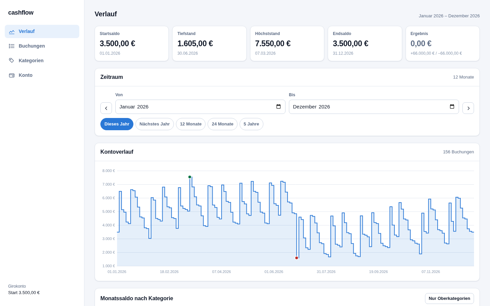

Drei Fragen beantwortet das Programm auf einen Blick:

- **Wann wird es eng?** Der Tiefstand steht mit Datum ganz oben — und eine
  Warnung erscheint, sobald das Konto rechnerisch ins Minus rutscht.
- **Wie schließt das Jahr?** Das Ergebnis zeigt, was am Ende mehr oder weniger
  auf dem Konto liegt als am Anfang.
- **Wo geht das Geld hin?** Der Monatssaldo schlüsselt jeden Monat nach
  Kategorien auf.

Deine Daten bleiben dabei in deinem Browser. Nichts wird hochgeladen, es gibt
kein Konto und keine Anmeldung.

---

## Starten

Du brauchst [Node.js](https://nodejs.org) (Version 22 oder neuer). Einmalig:

```bash
npm install
```

Dann jedes Mal:

```bash
npm run dev
```

Im Browser **http://localhost:3000** öffnen. Zum Beenden im Terminal `Strg + C`.

## Der erste Start

Beim ersten Aufruf fragt cashflow, womit es losgehen soll:

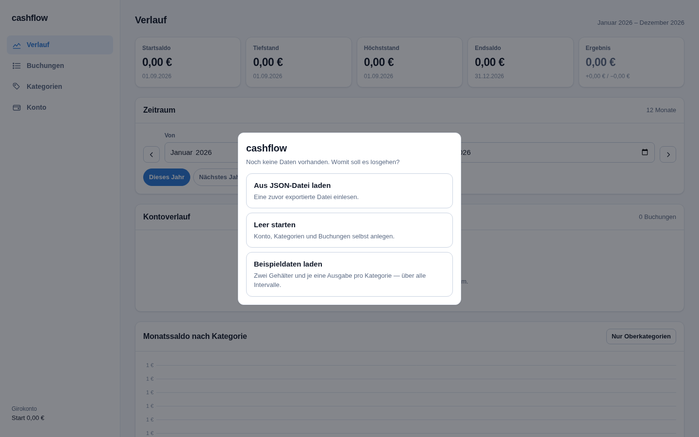

- **Aus JSON-Datei laden** — du hast schon einmal mit cashflow gearbeitet und
  deine Daten gesichert.
- **Leer starten** — du legst Konto, Kategorien und Buchungen selbst an.
- **Beispieldaten laden** — ein fertiger Haushalt zum Ausprobieren. Empfehlung
  für den Anfang: hier siehst du sofort, wie alles zusammenspielt, und kannst
  später jederzeit alles zurücksetzen.

Alle Abbildungen in dieser Anleitung zeigen diese Beispieldaten.

---

## Verlauf

Die Startseite. Ganz oben die fünf Kennzahlen für den gewählten Zeitraum:

| Kennzahl | Bedeutung |
|---|---|
| **Startsaldo** | Kontostand am ersten Tag des Zeitraums |
| **Tiefstand** | niedrigster Stand — und an welchem Tag |
| **Höchststand** | höchster Stand — und an welchem Tag |
| **Endsaldo** | Kontostand am letzten Tag |
| **Ergebnis** | Endsaldo minus Startsaldo, darunter Einnahmen und Ausgaben |

Darunter wählst du den **Zeitraum**. Er gilt für die ganze Seite und wird immer
in ganzen Monaten gerechnet. Die Schaltflächen *Dieses Jahr*, *Nächstes Jahr*,
*12 Monate*, *24 Monate* und *5 Jahre* springen direkt dorthin; mit `‹` und `›`
verschiebst du den Zeitraum um ein Jahr.

Der **Kontoverlauf** zeichnet den Kontostand als Treppe — er springt mit jeder
Buchung und bleibt dazwischen gleich. Der grüne Punkt markiert den Höchststand,
der rote den Tiefstand. Fahre mit der Maus über die Linie, um den Stand an
einem Tag abzulesen.

Weiter unten der **Monatssaldo nach Kategorie** und darunter jede einzelne
Buchung mit laufendem Kontostand:

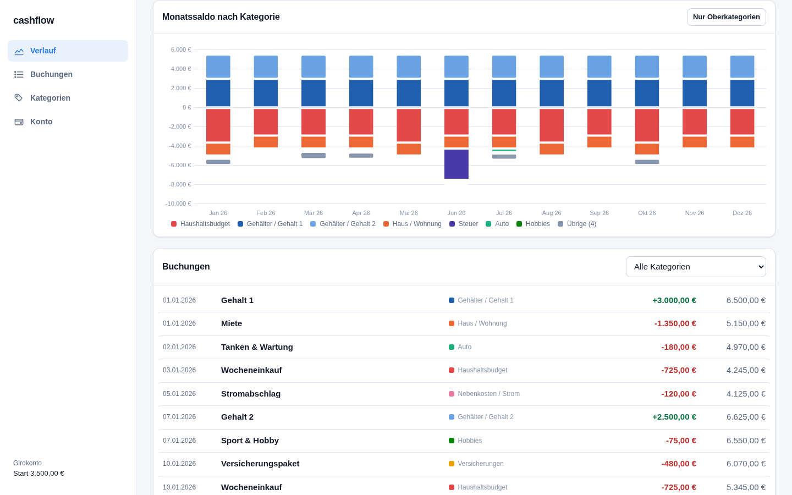

Einnahmen zeigen nach oben, Ausgaben nach unten. *Nur Oberkategorien* fasst
Unterkategorien zusammen — aus „Nebenkosten / Strom", „Nebenkosten / Wasser"
und „Nebenkosten / Telefon" wird ein Balken „Nebenkosten". Über *Alle
Kategorien* rechts filterst du die Buchungsliste; wählst du eine Oberkategorie,
sind ihre Unterkategorien mit dabei.

---

## Buchungen

Hier pflegst du, was regelmäßig passiert. Jede Zeile ist eine wiederkehrende
Einnahme oder Ausgabe.

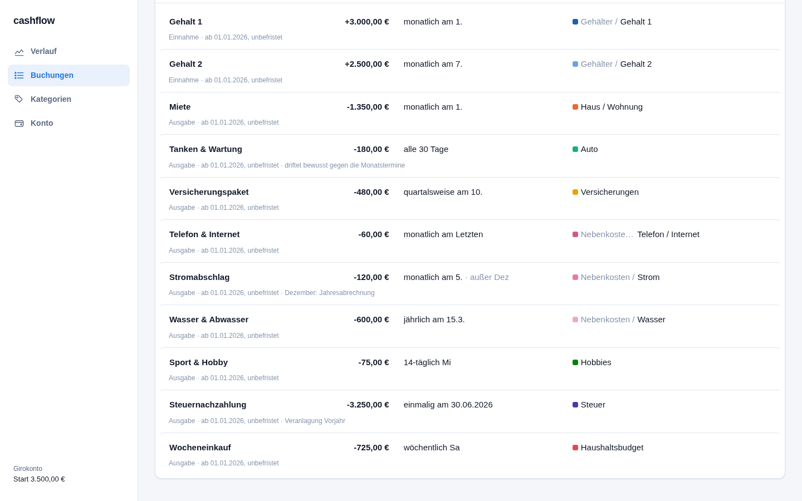

**Jede Angabe in der Zeile lässt sich direkt anklicken und ändern** — es gibt
kein separates Formular, das du erst öffnen und wieder speichern musst.
Änderungen wirken sofort.

| Angabe | Klick darauf öffnet |
|---|---|
| **Bezeichnung** | ein Eingabefeld zum Umbenennen |
| **Betrag** | Einnahme/Ausgabe und die Betragsstufen |
| **Wiederholung** | Rhythmus und Ausnahmemonate |
| **Kategorie** | die Auswahl aus deinem Kategoriebaum |
| **⋯** | Laufzeit, Notiz, Duplizieren, Löschen |

Die kleine Zeile unter jeder Buchung fasst zusammen, was nicht ins Raster
passt: Art, Laufzeit, Notiz und ob mehrere Betragsstufen hinterlegt sind.

### Wiederholung einstellen

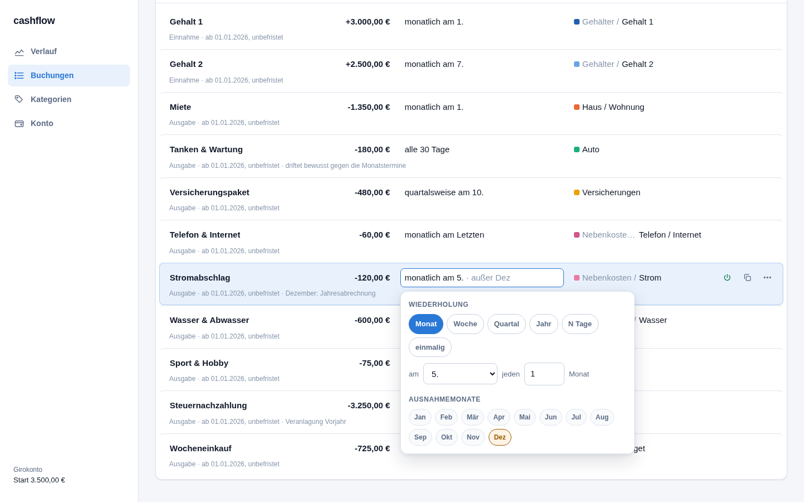

Sechs Rhythmen stehen zur Wahl:

| Rhythmus | Beispiel |
|---|---|
| **Monat** | jeden Monat am 1. · jeden 2. Monat am Monatsletzten |
| **Woche** | jeden Samstag · jede 2. Woche mittwochs |
| **Quartal** | im 1. Quartalsmonat am 10. |
| **Jahr** | jeden 15. März |
| **N Tage** | alle 30 Tage — wandert bewusst durch den Kalender |
| **einmalig** | nur an einem Datum |

Wählst du als Tag den **Monatsletzten**, trifft die Buchung im Februar den 28.
bzw. 29. — du musst nichts nachpflegen.

Darunter die **Ausnahmemonate**: Klick auf *Dez*, und die Buchung entfällt
jeden Dezember. Genau so ist der Stromabschlag im Beispiel gebaut, weil im
Dezember die Jahresabrechnung kommt.

### Beträge, die sich ändern

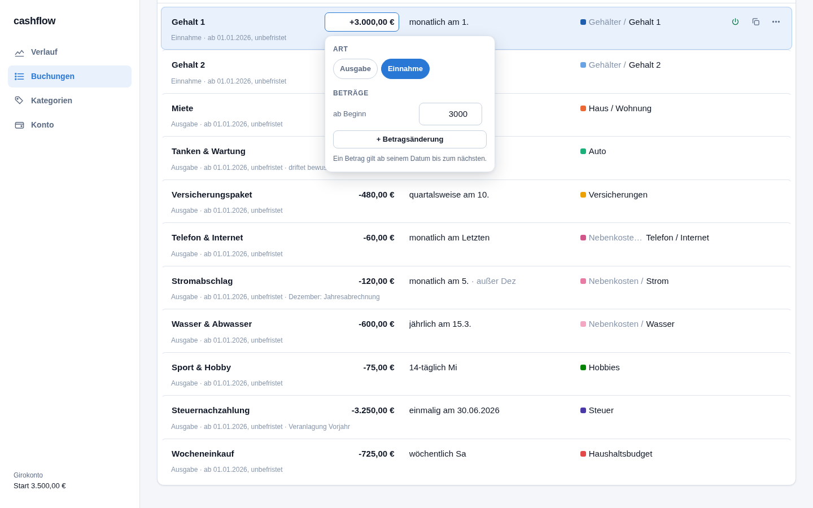

Ein Betrag muss nicht für immer gelten. Über **+ Betragsänderung** legst du
eine Stufe an: „ab Beginn 3.000 €, ab 01.07.2027 3.450 €". Beliebig viele
Stufen sind möglich; jede gilt ab ihrem Datum bis zur nächsten. Die kleine
hochgestellte Zahl am Betrag zeigt dir, wie viele Stufen hinterlegt sind.

Ob es eine Einnahme oder Ausgabe ist, stellst du im selben Editor um. Beträge
trägst du immer positiv ein — das Vorzeichen ergibt sich daraus.

### Weitere Handgriffe

Rechts in jeder Zeile:

- **⏻ stilllegen** — die Buchung bleibt erhalten, zählt aber nicht mehr mit.
  Gut, um durchzuspielen, was ohne sie passiert.
- **⧉ duplizieren** — legt eine Kopie direkt darunter an, sinnvoll für
  Ähnliches wie zwei Versicherungen.
- **⋯** — Laufzeit („läuft ab", „läuft bis"), Notiz und Löschen.

Eine **Laufzeit** brauchst du für alles Befristete: ein Kredit, der in drei
Jahren ausläuft, oder ein Abo, das erst nächsten Monat beginnt.

**Ohne Maus:** ↑ und ↓ wechseln die Zeile, ← und → die Angabe innerhalb der
Zeile, `Enter` öffnet sie, `Esc` schließt wieder.

---

## Kategorien

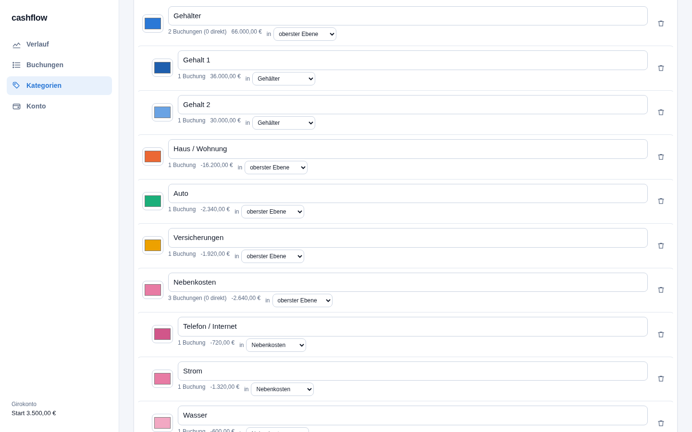

Kategorien geben den Auswertungen Struktur und den Diagrammen ihre Farben. Sie
lassen sich **beliebig tief verschachteln**: „Nebenkosten" mit „Strom",
„Wasser" und „Telefon / Internet" darunter.

- **Name und Farbe** änderst du direkt in der Zeile.
- **in …** hängt die Kategorie unter eine andere. Eine Kategorie in ihren
  eigenen Unterbaum zu hängen, lässt das Programm gar nicht erst zu.
- Neben jeder Kategorie steht, wie viele Buchungen sie umfasst und welchen
  Saldo sie im gewählten Zeitraum ergibt — **inklusive ihrer Unterkategorien**.
- **Löschen** entfernt nur die Kategorie: Unterkategorien rücken eine Ebene
  nach oben, die Buchungen bleiben und stehen danach ohne Kategorie da.

---

## Konto & Daten

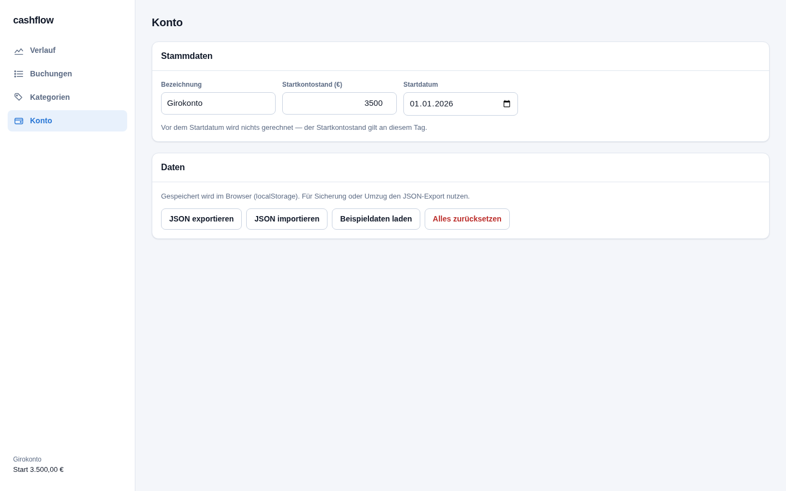

Oben die Stammdaten: **Bezeichnung**, **Startkontostand** und **Startdatum**.
Vor dem Startdatum wird nichts gerechnet — der Startkontostand ist der Stand an
genau diesem Tag. Am einfachsten trägst du hier den heutigen Kontostand und das
heutige Datum ein.

Darunter deine Daten:

- **JSON exportieren** — lädt alles als Datei herunter. Deine Sicherung.
- **JSON importieren** — liest so eine Datei wieder ein und ersetzt den
  aktuellen Stand.
- **Beispieldaten laden** — ersetzt alles durch den Beispielhaushalt.
- **Alles zurücksetzen** — löscht alles; danach fragt der Startdialog erneut.

> **Wichtig:** Deine Daten liegen im Speicher deines Browsers. Löschst du die
> Browserdaten oder wechselst du das Gerät, sind sie weg. Exportiere deshalb
> hin und wieder eine Datei — das ist zugleich der Weg auf ein anderes Gerät.

---

## Am Telefon

cashflow ist für kleine Bildschirme gemacht: unten eine Navigationsleiste in
der Daumenzone, und die Editoren fahren als Blatt von unten ein.

<p>
  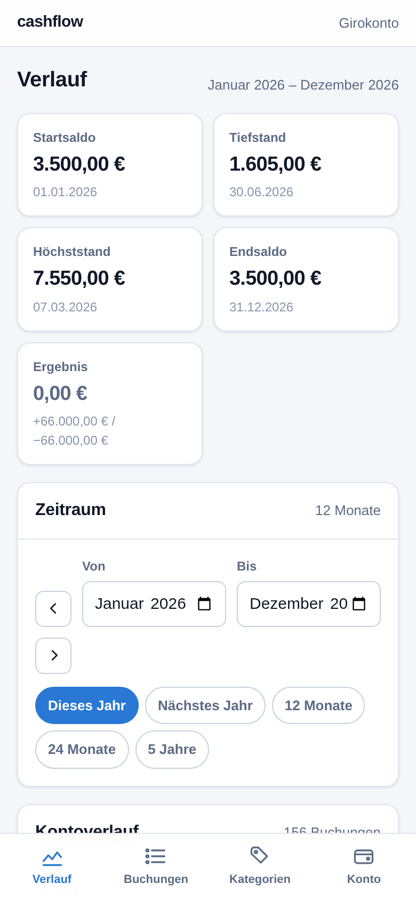
  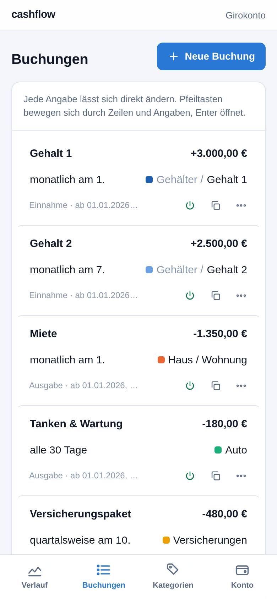
  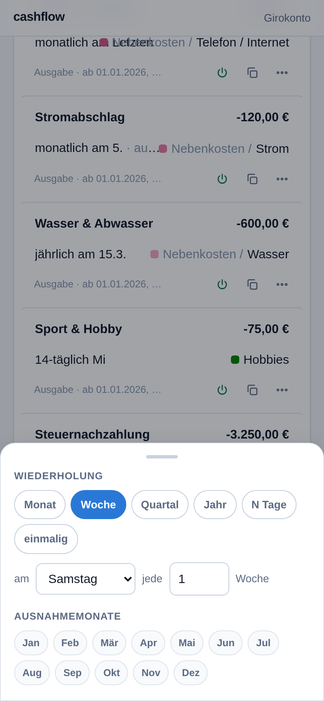
</p>

Folgt dein System einem dunklen Erscheinungsbild, stellt sich cashflow
automatisch darauf ein:

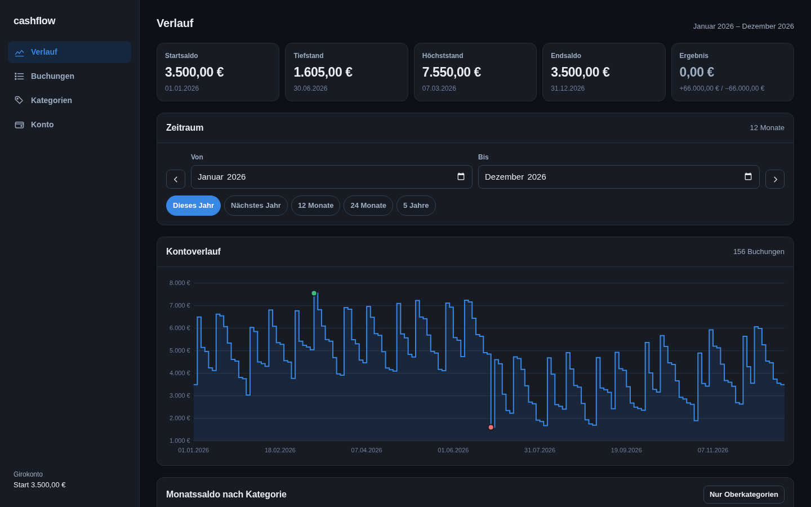

---

## Kurzrezepte

**Gehaltserhöhung ab Juli eintragen**
Buchungen → Betrag des Gehalts anklicken → *+ Betragsänderung* → Datum auf den
1. Juli, neuen Betrag eintragen. Der Verlauf rechnet ab dann mit dem neuen Wert.

**Beitrag, der im Dezember entfällt**
Buchungen → Wiederholung anklicken → unter *Ausnahmemonate* auf *Dez* tippen.

**Sehen, wann es eng wird**
Verlauf → Zeitraum auf *12 Monate* oder *5 Jahre* stellen. Der Tiefstand oben
nennt Betrag und Datum; rutscht das Konto ins Minus, erscheint zusätzlich eine
Warnung.

**Durchspielen, was ohne eine Ausgabe passiert**
Buchungen → ⏻ in der Zeile. Die Kennzahlen rechnen sich sofort neu. Nochmal
tippen macht es rückgängig.

**Daten auf einen anderen Rechner bringen**
Konto → *JSON exportieren*, Datei mitnehmen, dort → *JSON importieren*.

---

<sub>Technische Unterlagen für die Weiterentwicklung stehen in
[Architecture.md](Architecture.md).</sub>
